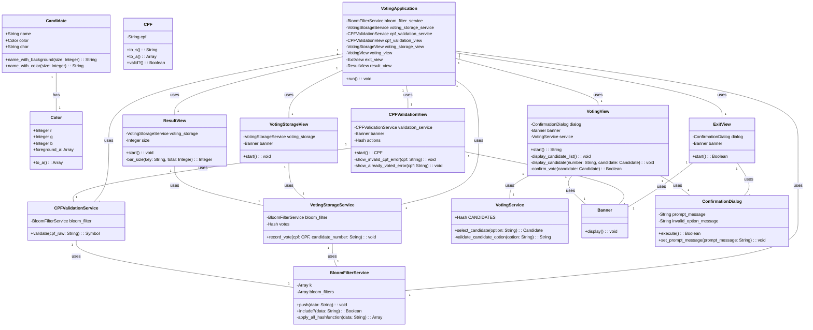

# Voting Application


Este é um projeto de aplicação de votação desenvolvido para o curso de Desenvolvimento Backend Ruby da **Softex**. A aplicação permite gerenciar a votação de candidatos, incluindo validação de CPF, registro de votos e exibição de resultados.

## Funcionalidades
- **Validação de CPF**: Verifica se um CPF é válido e se já foi utilizado para votar.
- **Registro de Votos**: Permite ao usuário votar em um candidato e armazena o voto.
- **Visualização de Resultados**: Exibe um gráfico dos resultados da votação.
- **Interface do Usuário**: Utiliza várias views para interagir com o usuário, incluindo mensagens de confirmação e resultados.

## Estrutura do Projeto
### Diretórios e Arquivos
#### entity/:

- `candidate.rb`: Define a classe Candidate, que representa um candidato com nome, cor e caractere associado.
- `color.rb`: Define a classe Color, que representa uma cor RGB e calcula a intensidade da cor para definir a cor de primeiro plano.
- `cpf.rb`: Define a classe CPF, que representa e valida um CPF.

#### service/:

- `bloom_filter_service.rb`: Implementa o serviço de Bloom Filter para verificar se um CPF já votou.
- `cpf_validation_service.rb`: Valida um CPF usando o serviço de Bloom Filter.
- `voting_storage_service.rb`: Armazena os votos registrados e gerencia o armazenamento de votos.

#### view/:

- `component/banner.rb`: Define a classe Banner, que exibe um banner no terminal.
- `component/confirmation_dialog.rb`: Define a classe ConfirmationDialog, que exibe uma caixa de diálogo de confirmação para o usuário.
- `cpf_validation_view.rb`: Define a classe CPFValidationView, que solicita e valida o CPF do usuário.
- `exit_view.rb`: Define a classe ExitView, que pergunta ao usuário se deseja votar novamente.
- `result_view.rb`: Define a classe ResultView, que exibe os resultados da votação.
- `voting_storage_view.rb`: Define a classe VotingStorageView, que confirma que o voto foi registrado com sucesso.
- `voting_view.rb`: Define a classe VotingView, que exibe os candidatos e confirma o voto do usuário.
- `main.rb`: O arquivo principal que configura e executa a aplicação de votação, inicializando os serviços e views necessários.

## Requisitos
- **Ruby 2.5** ou superior
## Instalação

Clone o repositório e navegue até o diretório do projeto:

```bash
git clone https://github.com/victorFlorentino12/Projeto_ruby_softex
cd Projeto_ruby_softex
```
Instale as dependências
```bash
gem install murmurhash3
gem install cityhash
gem install ruby-xxhash
```
## Uso
Para executar a aplicação, execute o arquivo `main.rb`:

```bash
ruby main.rb
```
O fluxo da aplicação será iniciado, incluindo a validação do CPF, escolha do candidato, registro do voto e exibição dos resultados finais.

## Documentação
Cada classe e método possui comentários de documentação que descrevem sua funcionalidade. Veja os arquivos `.rb` para detalhes sobre a implementação de cada componente.

## Diagrama de classes



## Licença
Este projeto está licenciado sob a Licença MIT. Veja o arquivo [LICENSE](LICENSE) para mais detalhes.
# OO-funcionario
